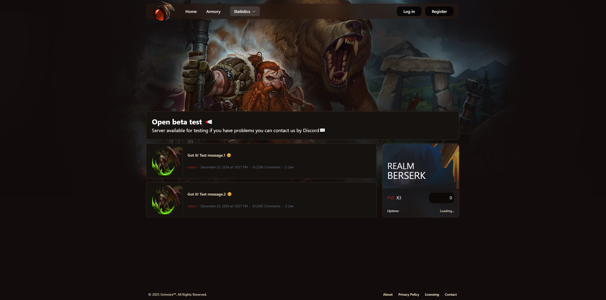

# Grimoire-ui
# EN: Project Description

## Overview
This project is currently in development. It leverages the following technologies:

- **Node.js**: v22.12.0
- **React**: v19.0.0
- **Tailwind CSS** + **NextUI**
- **Vite**
- **i18n**: Support en and ru.

### Current Status
The project is a work in progress. For a look at the previous version, check out the demo [here](https://warhoop.su).

### Features Implemented
- **Full Armory**: Complete inventory and equipment management.
- **Ladder**: Competitive ranking and progression system.
- **Status server**: Uptime.
- **Online**: Online players.
- **News**: Dynamic news and updates section.
- **Account Panel**: User management and settings panel.
- **Other Features**: Additional features under development.

## Features
- Responsive design with **Tailwind CSS**
- UI components powered by **NextUI**
- Modern React development practices

## Contributing
Feel free to submit issues or pull requests if you find any bugs or have ideas for improvements.

## License
[MIT License](LICENSE)

## RU: Описание проекта

Этот проект находится в стадии разработки. В нем используются следующие технологии:

- **Node.js**: v22.12.0
- **React**: v19.0.0
- **Tailwind CSS** + **NextUI**
- **Vite**
- **i18n**: Поддержка 2-х языков en и ru.

### Текущий статус
Проект находится в процессе разработки. Ознакомиться с предыдущей версией можно [здесь](https://warhoop.su).

### Реализованные функции
- **Full Armory**: Полное управление инвентарем и экипировкой.
- **Ladder**: Система рейтинга и прогресса.
- **Статус сервера**: Время работы.
- **Онлайн**: Онлайн игроки.
- **Новости**: Динамическая новостная секция.
- **Панель управления аккаунтом**: Управление пользователями и настройками.
- **Прочие функции**: Дополнительные функции в процессе разработки.

## Функции
- Адаптивный дизайн с **Tailwind CSS**
- UI-компоненты на базе **NextUI**
- Современные практики разработки с React

## Вклад
Если вы нашли ошибки или у вас есть идеи по улучшению, присылайте предложения и pull request'ы.

## Лицензия
[MIT License](LICENSE)